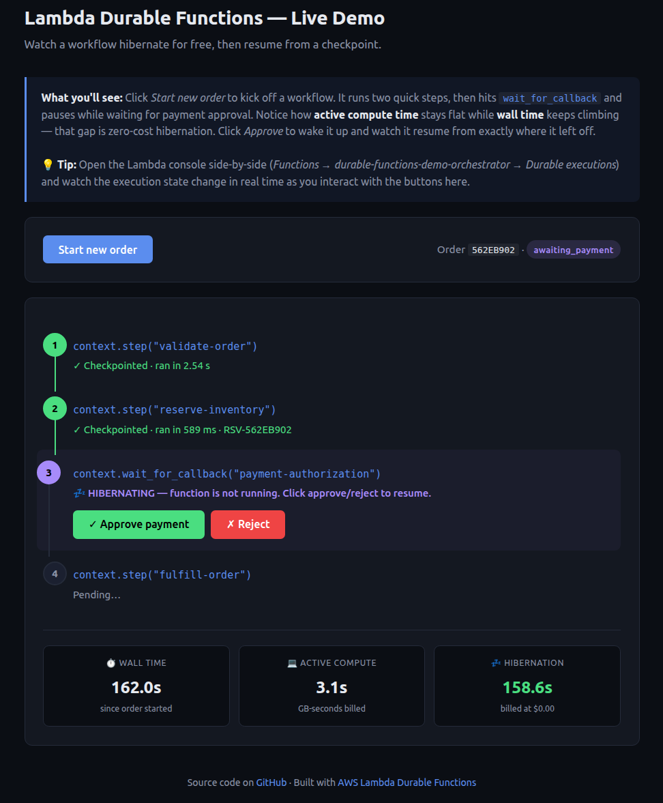
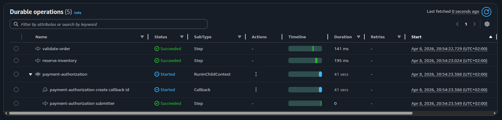
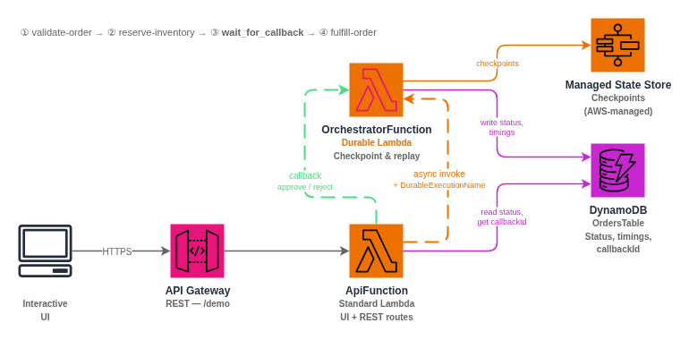

# Lambda Durable Functions — Live Demo

An interactive, one-click deployable demo that shows how **AWS Lambda
Durable Functions** (re:Invent 2025) hibernate for free and resume from
checkpoints — the flagship feature I dig into in the companion blog post.

Click the button, wait a minute, and open the URL in the stack outputs.
No CLI, no build tools, no code required.

## 🚀 Launch the demo

[](https://console.aws.amazon.com/cloudformation/home?region=us-east-1#/stacks/quickcreate?templateURL=https%3A%2F%2Fcloudvisor-jano-sandbox-public-artifacts.s3.us-east-1.amazonaws.com%2Fdurable-demo%2Ftemplate.yaml&stackName=durable-functions-demo)

This opens the CloudFormation console in `us-east-1` with the template
pre-loaded. Click **Create stack**, wait ~1 minute, then open the `UiUrl`
value in the **Outputs** tab.

> **Region:** The Lambda code zips are hosted in `us-east-1`, so the
> stack must be deployed there. Lambda requires its code bucket to live
> in the same region as the function.

> **Cost:** Everything in this demo fits comfortably inside the AWS free
> tier for one-off experimentation. Delete the stack when you're done.

---

## What you'll see

The deployed stack gives you a URL to a single-page web UI:



Open the Lambda console side-by-side to see the durable execution state:



```
┌─────────────────────────────────────────────────────────────┐
│  Lambda Durable Functions -- Live Demo                      │
│                                                             │
│  [ Start new order ]                                        │
│                                                             │
│  1. context.step("validate-order")    done  ran in 210 ms   │
│  2. context.step("reserve-inventory") done  ran in 220 ms   │
│  3. context.wait_for_callback(...)    HIBERNATING for 47s   │
│       [ Approve payment ]  [ Reject ]                       │
│  4. context.step("fulfill-order")     pending               │
│                                                             │
│  Wall time     Active compute     Hibernation               │
│  47.3 s        0.5 s              46.8 s (free)             │
└─────────────────────────────────────────────────────────────┘
```

The three metrics at the bottom are the core teaching moment:

- **Wall time** keeps ticking forever
- **Active compute** stays flat while the function is asleep
- **Hibernation** grows in green — billed at `$0.00`

Click *Approve payment* and the function wakes from its checkpoint,
runs the final step, and finishes — all without re-running the two
steps it already completed.

---

## How it works



```
POST /orders
      │
      ▼
OrchestratorFunction  (Durable Lambda)
      │
      ├─ step: validate-order         ← checkpointed ✓
      ├─ step: reserve-inventory      ← checkpointed ✓
      │
      ├─ wait_for_callback ───────────── HIBERNATES HERE
      │    │                              (zero compute cost while waiting)
      │    │   callbackId stored in DynamoDB
      │    │
      │    └── POST /orders/{id}/approve  →  send_durable_execution_callback_success
      │        POST /orders/{id}/reject   →  send_durable_execution_callback_failure
      │
      │   (function replays, skips completed checkpoints, resumes here)
      │
      └─ step: fulfill-order          ← checkpointed ✓
```

### Architecture

```
              +------------------------------------------+
              |          API Gateway (REST)               |
              |  GET  /              (interactive UI)     |
              |  POST /orders                             |
              |  GET  /orders/{orderId}                   |
              |  POST /orders/{orderId}/approve           |
              |  POST /orders/{orderId}/reject            |
              +-------------------+----------------------+
                                  |
                       +----------v----------+
                       |    ApiFunction       |
                       |  (standard Lambda)   |
                       +--+---------------+--+
                          | async invoke  | callback
                 +--------v------+  +-----v-----------------+
                 |  Orchestrator |  |  DynamoDB              |
                 |  Function     |<-|  OrdersTable           |
                 |  (Durable)    |  |  orderId -> state,     |
                 +---------------+  |  timings, callbackId   |
                                    +------------------------+
```

### Key concepts demonstrated

| Concept | Where |
|---|---|
| `@durable_execution` decorator | `src/orchestrator/handler.py` |
| `context.step()` — checkpointing | Steps 1, 2, 4, 5 of the orchestrator |
| `context.wait_for_callback()` — hibernation | Step 3 (payment approval) |
| `DurableConfig` in CloudFormation | `template.yaml → OrchestratorFunction` |
| `AWSLambdaBasicDurableExecutionRolePolicy` | `template.yaml → OrchestratorRole` |
| `InvocationType=Event` + `DurableExecutionName` | `src/api/handler.py → _start_order` |
| `send_durable_execution_callback_success/failure` | `src/api/handler.py → _send_callback` |

### The checkpoint-and-replay model

When the orchestrator hits `context.wait_for_callback()`:

1. **Checkpoint** — the SDK persists all completed step results.
2. **Hibernate** — the Lambda invocation exits. Billing stops immediately.
3. **Callback** — `send_durable_execution_callback_success` delivers the
   result and triggers a new invocation.
4. **Replay** — the function runs from the top. Each `context.step()`
   call checks the state store; completed steps return their stored
   result instantly without re-executing their wrapped code.
5. **Resume** — execution continues past `wait_for_callback` with the
   callback result as the return value.

Because of replay, all code inside `context.step()` must be **deterministic**
and all side effects must live inside step lambdas — otherwise they
re-execute on every replay.

---

## Clean up

```bash
aws cloudformation delete-stack \
  --stack-name durable-functions-demo \
  --region us-east-1
```

Or delete it from the CloudFormation console. This removes the Lambda
functions, DynamoDB table, API Gateway, and IAM roles.

---

## For developers: run it from source

Everything above is for readers who just want to click a button. If you
want to hack on the code, deploy from source with SAM:

```bash
# Prerequisites: AWS SAM CLI, Python 3.13, AWS credentials
sam build
sam deploy --guided     # on first deploy, answers are saved to samconfig.toml
```

The outputs of the stack include both `UiUrl` (the interactive demo) and
`ApiUrl` (the raw REST API).

### Project structure

```
durable-demo/
├── template.yaml               SAM / CloudFormation template
├── samconfig.toml              Default SAM deploy parameters
├── publish.sh                  Build, package and publish to the public artifacts bucket
├── src/
│   ├── orchestrator/
│   │   ├── handler.py          Durable order processing workflow
│   │   └── requirements.txt    aws-durable-execution-sdk-python
│   └── api/
│       ├── handler.py          API + embedded HTML UI
│       └── requirements.txt    boto3 >= 1.38
└── scripts/
    ├── start-order.sh          POST /orders  (CLI testing)
    ├── check-status.sh         GET  /orders/{orderId}
    └── approve-order.sh        POST /orders/{orderId}/approve|reject
```

### Publishing a new version of the one-click link

The "Launch Stack" button points to a packaged template hosted in
[cloudvisor-sandbox](https://github.com/janobarnard/cloudvisor-sandbox)'s
`public-artifacts` S3 bucket. To publish an updated build:

```bash
# Requires AWS credentials with write access to the bucket
./publish.sh
```

The script runs `sam build`, `sam package`, and uploads the packaged
template to `s3://cloudvisor-jano-sandbox-public-artifacts/durable-demo/template.yaml`
— the same stable URL the quick-create link references, so the button
immediately picks up the new version.

### CLI testing (without the UI)

```bash
API_URL=$(aws cloudformation describe-stacks \
  --stack-name durable-functions-demo \
  --region us-east-1 \
  --query 'Stacks[0].Outputs[?OutputKey==`ApiUrl`].OutputValue' \
  --output text)

./scripts/start-order.sh   "$API_URL"
./scripts/check-status.sh  "$API_URL" <ORDER_ID>
./scripts/approve-order.sh "$API_URL" <ORDER_ID>
```

---

## Further reading

- [AWS Lambda durable functions — Developer Guide](https://docs.aws.amazon.com/lambda/latest/dg/durable-functions.html)
- [Durable execution SDK (Python)](https://github.com/aws/aws-durable-execution-sdk-python)
- [aws-samples/sample-lambda-durable-functions](https://github.com/aws-samples/sample-lambda-durable-functions)
- [Deploy with IaC — Developer Guide](https://docs.aws.amazon.com/lambda/latest/dg/durable-getting-started-iac.html)

## License

MIT — see [LICENSE](LICENSE).
